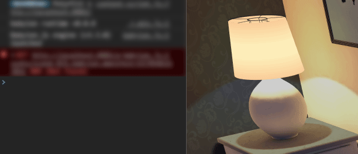
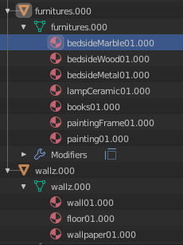

# Using \_runtime in an existing scene

We will take as an example a scene you may have seen before, the one I've made for a tutorial about Blender to BabylonJS, including lightmaps management: [From Blender to BabylonJS workflow](https://nothing-is-3d.com/data/medias/folio/3drealtime/lightmaps-workflow-tutorial/demo.html).


*Note that this scene is in standard workflow, not PBR.*

[Here a download link](https://github.com/babylon-runtime/_r.assets/raw/master/converting-existing-scene-to-runtime/converting-existing-scene-to-runtime.zip), containing:

- **original** folder: the raw BabylonJS scene, ready to be edited by you
- **converted** folder: full converted scene to \_runtime

Also, don't forget to point a [local webserver](https://www.nothing-is-3d.com/article28/use-a-local-webserver) into your unzipped folder. Notice that this scene was made on BJS [v3.3.0](https://github.com/BabylonJS/Babylon.js/tree/master/dist/previous%20releases/3.3) and Blender [2.79](https://download.blender.org/release/Blender2.79/) (with the now [deprecated](https://github.com/BabylonJS/BlenderExporter/tree/master/deprecated) .babylon exporter v5.6).

Of course, we'll also need to get the [last version of \_runtime](https://github.com/babylon-runtime/_r/releases/latest). You can notice I've already linked it line 9 of `index.html`:

```javascript
<script src="js/babylon.js"></script>
<script src="js/pep.min.js"></script>
<script src="js/_r.min.js"></script>
```
*Ready to go!*

In case you want to show the Inspector, uncomment the `scene.debugLayer.show();` part (lines 117 & 118).

<iframe
     src="https://codesandbox.io/embed/github/babylon-runtime/_r.assets/tree/master/converting-existing-scene-to-runtime/original?codemirror=1&highlights=117,118&fontsize=12&hidenavigation=1&theme=dark"
     style="width:100%; height:500px; border:0; border-radius: 4px; overflow:hidden;"
     title="babylonjs-with-runtime"
     allow="geolocation; microphone; camera; midi; vr; accelerometer; gyroscope; payment; ambient-light-sensor; encrypted-media; usb"
     sandbox="allow-modals allow-forms allow-popups allow-scripts allow-same-origin"
   ></iframe>

## Patch...works!

At this time, which is not even yet the beginning, you already are able to use \_runtime! In your browser or in codesanbox console, try to copy-paste this command line:

```javascript
_r.patch([
    {
        "*lamp*:material":{
            "emissiveTexture": null,
            "ambientColor": "red"
        }
    }
]);
```

If you've already took a look on [the documentation](https://babylon-runtime.github.io/), you probably guessed the result this patch is giving us:


*Patch patching. (just reload the page to cancel)*

Notice that in this exercice we will do a full conversion of our scene, which is already tweaked and finalized, but in other existing projects you can just keep them as they are and just call \_runtime when needed.

Example, if we insert this patch inside our `SceneLoader.Append` line 130:

```javascript
var books01 = scene.getMaterialByName("scene_BJS.books01.000");
books01.invertNormalMapX = true;

_r.patch([{
    "*lamp*:material": {
        "emissiveTexture": null,
        "ambientColor": "red"
    }
}]);
```
*This will give the exact same result as we got when using the command line into the browser console. (don't forget to remove this \_r.patch before continuing this tutorial). Check line 130 on the CodeSandbox below.*

[](https://codesandbox.io/embed/convert-scene-first-try-with-patch-ef2p5?codemirror=1&highlights=130,131,132,133,134,135,136,137&fontsize=12&hidenavigation=1&theme=dark)

So, let's start to convert the easiest part: mesh & material tweaking (line 95 to 128). We just have to convert  `scene.getMaterialByName("scene_BJS.lampFabric01.000")` as a \_runtime selector `{"scene_BJS.lampFabric01.000":{ [...] }}`.

Here I like to use the `*` char, to ease the patch reading: `{"*lampFabric01.*":{ [...] }}`. This `*` will already allow some versatility in our workflow:

- the old .babylon exporter was adding a prefix (using .babylon file name) to the materials, using the `*` as suffix on the \_r selector, we don't care any more what exporter you're using (names can be `scene_BJS.lampFabric` or `lampFabric`, they both will be taken into account).
- the `.000` suffix can be instantly broke on Blender if the cgartist make a material duplication (turning into `.001`). Again, the `*` as suffix don't pay attention any longer to this part

Now the properties: `.diffuseColor = BABYLON.Color3.Black();` will become `diffuseColor : "black",`.

Try to convert all the tweaks inside a `_r.patch`, pay attention to `,`! Once materials are done, why not also include collisions meshes?

Below the result, check line 95 on the CodeSandbox:

```javascript
/** END OF LIGHTMAP ASSIGNATION PROCESS **/

_r.patch([

    /* mesh tweaking */

    {
        "_collisions": {
            "isVisible": false
        }
    },

    /* material tweaking */

    {
        "*lampFabric01.*": {
            "diffuseColor": "black",
            "ambientColor": "black",
            "emissiveColor": [0.47, 0.28,
                0.07
            ], // in combination with emissiveTexture
            "useEmissiveAsIllumination": true // we want light to burn
        }
    },
    {
        "*lampBulb01.*": {
            "emissiveColor": "#ffffff"
        }
    },
    {
        "*lampMetal01.*": {
            "diffuseColor": "black",
            "ambientColor": "#222222",
            "specularColor": [0.88, 0.59, 0.41],
            "specularPower": 80
        }
    },
    {
        "*holdout.*": {
            "disableLighting": true
        }
    }, {
        "*floor01.*, *books01.*": {
            "invertNormalMapX": true
        }
    }
]);

/* tools */
```

[](https://codesandbox.io/embed/convert-scene-tweaks-as-patch-zew4r?codemirror=1&highlights=95&fontsize=12&hidenavigation=1&theme=dark)

Notice that \_r allows you to place comments inside the patches.

And why not putting this inside a dedicated file, for more clarity? We can create a `/patches/` folder inside `/assets/` and name our patch file the way we want (except the extension), here `tweaks.patch`:

```javascript
/** END OF LIGHTMAP ASSIGNATION PROCESS **/

_r.patch(["assets/patches/tweaks.patch"]);

/* tools */
```
*Better.*

Actually, we can also patch our camera using a camera.patch for example, and, let's be crazy, also our scene. Keep for now the camera raw BJS creation:

```javascript
var arcRotCam = new BABYLON.ArcRotateCamera(
    "arcRotateCamera",
    5.5,
    1.2,
    3.75,
    new BABYLON.Vector3(-0.8, 0.75, 0.8),
    scene
);
arcRotCam.attachControl(canvas, true);
```

[](https://codesandbox.io/embed/convert-scene-multiple-patch-files-20pz3?codemirror=1&highlights=19,81,82,83,84,85&fontsize=12&hidenavigation=1&theme=dark)

*Raw camera creation on line 19, _r.patch line 80.*

## Simplify the loading

We're just going to get rid of most of the code, using `_r.launch()`. The only code inside `<script>` tag that we'll keep untouched - for now - will be the lightmap assignation processing.

As even the canvas and engine renderloop can be handled by \_runtime, steps will be:

- delete `<canvas>` tags
- delete all engine and scene creation
- replace `SceneLoader.Append()` with `_r.launch()`
- use `_r.ready()` to be able to use our lightmap javascript
- as we'll loose our js scene variable: replace `scene` by `_r.scene` 

Note that it's also possible to keep using your canvas or engine, in case you want custom [EngineOptions](https://doc.babylonjs.com/api/classes/babylon.engine#constructor) for example.

As we're not using a camera stored into the .babylon, but a created one from scratch, we need to include its creation inside our cameras.patch, then make it current activeCamera.

To do that, we'll use the "execute" patch functionnality before the camera patch properties we've already made:

```javascript
[{
        "exec": function () {
            // we can do the code we want here
            new BABYLON.ArcRotateCamera(
                "arcRotateCamera",
                1, 1, 1, BABYLON.Vector3.Zero(),
                _r.scene); // don't forget the _r as prefix
            );
        }
    },
    {
        "arcRotateCamera": {
            alpha: 5.5,
            beta: 1.2,
            [...],
    }
},
{
    "exec": function(){
        // now activating the camera
        _r.activateCamera("arcRotateCamera");
    }
}]
```
*Camera is created, then patched, then activating.*

So here the new structure:

<iframe
     src="https://codesandbox.io/embed/convert-scene-using-launch-cct37?codemirror=1&fontsize=12&hidenavigation=1&theme=dark"
     style="width:100%; height:500px; border:0; border-radius: 4px; overflow:hidden;"
     title="convert-scene-using-launch"
     allow="geolocation; microphone; camera; midi; vr; accelerometer; gyroscope; payment; ambient-light-sensor; encrypted-media; usb"
     sandbox="allow-modals allow-forms allow-popups allow-scripts allow-same-origin"
   ></iframe>

Notice the loss of `#canvas` css which is now useless in `css/styles.css` (\_runtime automatically create a canvas with these parameters).

## Get our hands dirty

Time to see how to deal with lightmaps.

In my original tutorial, my javascript code was as simple as possible, to allow people to understand it as much as possible. But this had the inconvenient to assign the texture file even if it was still not downloaded! In raw javascript we need to play with the [onLoad](https://doc.babylonjs.com/api/classes/babylon.texture#constructor) callback, but this is tricky to explain and understand when you're not a dev ([here a playground](https://www.babylonjs-playground.com/#4AJ16M#15) using this callback).

\_runtime will here be useful for us by loading and creating the lightmap texture and only then patching our targets materials and assigning them the right lightmap. We're going to see two ways:

- easy way: write a patch for each lightmapped mesh, loading directly texture into lightmapTexture channel. Great when you just have a few mesh, annoying when there're hundred.
- advanced way: more flexible with large number of meshes, we'll use raw javascript. You'll see we'll still gain a lot of lines by the help of \_r.

### Easy way, using patches

We can start by creating a patch dedicated to lightmaps which I named in a very original way `lightmaps.patch`. As our lightmaps should be assigned by mesh, it would be more logical to use mesh names selector, but first, just give a try on materials.



*Our materials list.*

Instead of writing each names, we can invoke the power of `*`!

```js
"*wall*:material, *floor*:material": { // all our wallz.000 materials are selected
```

And now, [loading the texture](https://babylon-runtime.github.io/api/load):

```js
"lightmapTexture": _r.load.texture("assets/lightmaps/wallz.000_LM.jpg", {
                "coordinatesIndex": 1
            }),
"useLightmapAsShadowmap": true
```

Notice that we also take the opportunity to assign UV2 channel on the fly. Don't forget to tell BJS we want shadowmap. If you're using another test scene as .glb, you may need to patch vScale to -1 also.

We should now have our lightmaps:

<iframe
     src="https://codesandbox.io/embed/convert-scene-lightmaps-eg709?codemirror=1&fontsize=12&hidenavigation=1&module=%2Fassets%2Fpatches%2Flightmaps.patch&theme=dark"
     style="width:100%; height:500px; border:0; border-radius: 4px; overflow:hidden;"
     title="convert-scene-lightmaps-using-patch-materials"
     allow="geolocation; microphone; camera; midi; vr; accelerometer; gyroscope; payment; ambient-light-sensor; encrypted-media; usb"
     sandbox="allow-modals allow-forms allow-popups allow-scripts allow-same-origin"
   ></iframe>

But listing all our materials is a little boring. Using meshes names like in the [raw BabylonJS tutorial scene](https://www.nothing-is-3d.com/article27/from-blender-to-babylonjs#tocBJSSideLightmaps) is a little more convenient, however maybe a bit more tricky to understand because we'll cycle through our mesh materials & submaterials directly into the patch.

For this we have the ability to use kind-of special keywords/selectors: `material` and `subMaterials`. As we're using here .babylon format, meshes can use submaterials (in case of .glTF, one mesh = one material).

```js
{
    "*meshName*:mesh": {
        material:{ // current mesh material
            subMaterials:{ // cycle through subMaterials also (.babylon format)
                "*":{ // for each subMaterials
                    "lightmapTexture": _r.load.texture(...)
```

You've probably note the `"*"`, which is a special case here: `subMaterials` send a javascript array, so in case you want only the first element of subMaterials list, you can ask for `0: {}`. Here, `*` just tell `I want all elements`, as in selector, but that's not a selector! Writing `*paper*` to just get wallpaper material will not work.

[](https://codesandbox.io/embed/convert-scene-lightmaps-using-patch-meshes-01-wkljm?codemirror=1&highlights=5,6,7&fontsize=12&hidenavigation=1&module=%2Fassets%2Fpatches%2Flightmaps.patch&theme=dark)

But what if a mesh doesn't have submaterials? Here the lightmap will not be assigned right?

Right. Solution is simple: patch also materials:

```js
{
    "*meshName*:mesh": {
        material:{ // current mesh material
            "lightmapTexture": _r.load.texture(...), // lightmap if material,
            "useLightmapAsShadowmap": true
            subMaterials:{ // cycle through subMaterials also (.babylon format)
                "*":{ // for each subMaterials
                    "lightmapTexture": _r.load.texture(...)
```

[](https://codesandbox.io/embed/convert-scene-lightmaps-using-patch-meshes-02-s4lj2?codemirror=1&highlights=5,6,10,11,12&fontsize=12&hidenavigation=1&module=%2Fassets%2Fpatches%2Flightmaps.patch&theme=dark)

### Advanced way, mix of javascript & \_r

Sometimes, for particular operations, you'll not avoid using raw javascript.

The lightmap logic here will start by navigating through our lightmapped meshes, so we need a list containing meshes names ([ReTiCo Blender addon](https://github.com/Vinc3r/ReTiCo/wiki/Meshes) could help ;) ).

If you've tried the easy way above, don't forget to remove the call to lightmaps.patch.

Once we have our names, we can cycle through them and:

1. load the lightmap (using the current mesh name)
2. once loaded, assign the lightmap on the current mesh material
    - if mesh have multimaterial, cycle through multimaterials to assign lightmap

\_r will help you thanks to `_r.select()` and `_r.load.texture()`.

For readibility, we can put lightmap code in a dedicated file. We will call lightmap function on the \_r.ready.

That's what we have in index.html:

```js
<script src="js/_r.min.js"></script>
<script src="js/lightmaps.js"></script>
```

```js
_r.ready(function() {
    /** LIGHTMAP ASSIGNATION PROCESS **/

    const lightmappedMeshes = ["furnitures.000", "wallz.000"]; // lightmapped meshes
    assignLightmapsToMeshes(lightmappedMeshes);
```

And the lightmaps.js file:

```js
function assignLightmapsToMeshes(lightmappedMeshes) {
  lightmappedMeshes.forEach(function(currentMeshName) {
    // we first load the texture, based on name convention
    _r.load
      .texture("assets/lightmaps/" + currentMeshName + "_LM.jpg", {
        coordinatesIndex: 1 // let's patch so it use UV2
      })
      .then(function(lightmap) {
        // now the texture is ready, we can assign it
        _r.select("*" + currentMeshName + "*:mesh").forEach(function(
          currentMesh
        ) {
          const material = currentMesh.material;
          // in case of multimat, we have to cycle through it
          if (material.getClassName() === "MultiMaterial") {
            material.subMaterials.forEach(function(subMaterial) {
              subMaterial.lightmapTexture = lightmap;
            });
          } else {
            // if classic material, just assign the lightmap
            material.lightmapTexture = lightmap;
          }
        });
      });
  });
}
```

[](https://codesandbox.io/embed/convert-scene-lightmaps-using-javascript-01-grvv3?codemirror=1&highlights=2,4,10,17,21&fontsize=12&hidenavigation=1&module=%2Fjs%2Flightmaps.js&theme=dark)

Oops, it seems we forgot to set `useLightmapAsShadowmap` as true. You can add it to the javascript code, or in the already existing tweaks.patch.

And that's all, our scene is now fully converted!

<iframe
     src="https://codesandbox.io/embed/convert-scene-lightmaps-using-javascript-02-6089o?codemirror=1&fontsize=12&hidenavigation=1&theme=dark&highlights=9,31,39"
     style="width:100%; height:500px; border:0; border-radius: 4px; overflow:hidden;"
     title="convert-scene-lightmaps-using-javascript-02"
     allow="geolocation; microphone; camera; midi; vr; accelerometer; gyroscope; payment; ambient-light-sensor; encrypted-media; usb"
     sandbox="allow-modals allow-forms allow-popups allow-scripts allow-same-origin"
   ></iframe>

Note that this lightmap script can be easily adapted on any scenes, here an example with [the CornellBox scene as .glb](https://github.com/BabylonJS/MeshesLibrary/tree/master/CornellBox):

<iframe
     src="https://codesandbox.io/embed/convert-scene-lightmap-script-to-another-scene-ci3og?codemirror=1&highlights=34,39&fontsize=12&hidenavigation=1&theme=dark&runonclick=1"
     style="width:100%; height:500px; border:0; border-radius: 4px; overflow:hidden;"
     title="convert-scene-lightmap-script-to-another-scene"
     allow="geolocation; microphone; camera; midi; vr; accelerometer; gyroscope; payment; ambient-light-sensor; encrypted-media; usb"
     sandbox="allow-modals allow-forms allow-popups allow-scripts allow-same-origin"
   ></iframe>

## Adding few features

Now we have fully integrated \_runtime, maybe we want to go further to add some functionnality? Note that this new features could also be added without having to convert the scene at all.
We'll start by something which is a bit painful to customize in raw BJS, named...

### Custom loading screen

Don't forget to check the [\_r API](https://babylon-runtime.github.io/api/loading-screen).

- *custom loading screen*
- *interactions* (light on/off => disable lightmaps? or using a new set)

---

don't forget to update the download zip