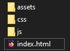

# Using \_runtime in an existing scene

We will take as example a scene that you maybe already seen, the one I've made for a tutorial about Blender to BabylonJS, including lightmaps management: [From Blender to BabylonJS workflow](https://nothing-is-3d.com/data/medias/folio/3drealtime/lightmaps-workflow-tutorial/demo.html).


> notice this scene is in standard workflow, not PBR

[Download link](https://www.nothing-is-3d.com/article27/from-blender-to-babylonjs#tocWorkflowFewWords) is available in the tutorial. Once unzip, delete all html in the root of `/BJS/` folder except `tuto-final.html`, then rename this particular file into `index.html`, and we're ready to go.



Also, don't forget to point a [local webserver](https://www.nothing-is-3d.com/article28/use-a-local-webserver) into this `/BJS/` folder. Notice that this scene was made on BJS v3.3.0 but that's not a big deal.

Of course, we'll also need to get the [last version of \_runtime](https://github.com/babylon-runtime/_r/releases/latest). Place the `_r.min.js` from the zip (located in the `/dist/` folder) into our `/js/` folder, and link the script in `index.html` below pep (line 8).

```javascript
<script src="js/babylon.js"></script>
<script src="js/pep.min.js"></script>
<script src="js/_r.min.js"></script>
```

> this time, ready to go for real!

## Patch...works!

At this time, which is not even yet the beginning, you already be able to use \_runtime! In your browser console, try to copy-paste this command line:

```javascript
_r.patch([
    {
        "*lamp*:material":{
            emissiveTexture: null,
            ambientColor: "red"
        }
    }
]);
```

If you've already took a look on [the documentation](https://babylon-runtime.github.io/), you probably guess the result this patch give us:


> Patch patching. (just reload the page to cancel)

Notice that in this exercice we will do a full convertion of our scene, which is already tweaked and finalized, but in other existing projects you can just keep them as they are and just call \_runtime when needed.

Example, inside our `SceneLoader.Append` line 129:

```javascript
var books01 = scene.getMaterialByName("scene_BJS.books01.000");
books01.invertNormalMapX = true;

_r.patch([{
    "*lamp*:material": {
        emissiveTexture: null,
        ambientColor: "red"
    }
}]);
```

> This will give the exact same result as we got when using the command line into the browser console. (don't forget to remove this \_r.patch before continuing this tutorial)