# Why artists should use _runtime

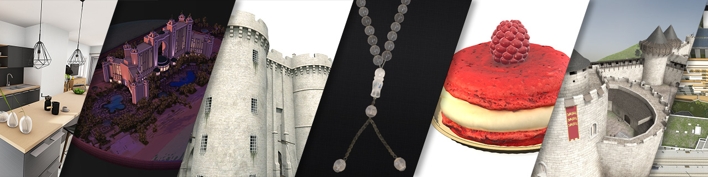

## Behind the scene

When I (Vincent Lamy, aka [V!nc3r](https://forum.babylonjs.com/u/Vinc3r/summary)) first started to get my hands into webGL through Babylon.JS (BJS), while I was used to Unity3D engine I'm not going to hide that I was a little frightened - but also intrigued: relatively new technology, raw javascript, no official graphic editor, no PBR, no lighting engine...

Actually there is an [editor](http://editor.babylonjs.com/) made by a [BJS user](https://github.com/julien-moreau), which is a great piece of work but our workflow soon get into problematics: artists often need to export & re-export 3D scenes multiple times in a day, and unfortunatly by using the editor you're loosing all your wonderful modifications on the BJS side! Plus as a team we need to work at the same time on our applications.

That's why in 2016, my teamate (Fabien Le Vavasseur aka [sharp](https://forum.babylonjs.com/u/sharp/summary)) had in mind to create a kind of overlay of BJS to help me speed up my tasks and not be restrict by my javascript skills, named **\_runtime**.


This tool allowed me this kind of efficient worklow:

1. Export my scene from Blender (or any 3D modeler),
2. Tweak materials and interactions in BabylonJS,
3. Come back to Blender to make some modifications, then re-export my scene to BJS...
4. ... and not loosing any of my tweaks!

We called this not-loosed-modifications: **patchs**.

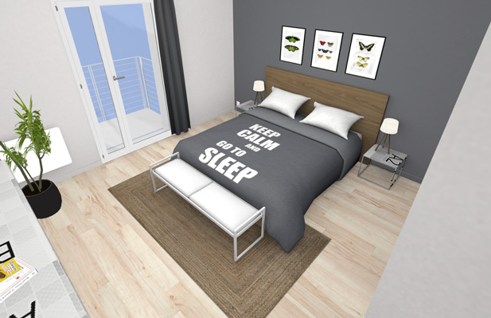

> one of my firsts tries using BabylonJS

## Time to \_run

So, why an artist would like \_runtime? Because it will not only avoid you to loose some of your tweaks, but also make more easy to write, read and maintain your application.

Assuming we have the good practice to name our assets, we can take as example the need to:

- tweak albedoColor and roughness for all materials using `woods` in their names
- enable collisions on all meshes with `_coll` in their names (cameras also of course)

Here how to patch our scene, using both raw javascript & \_runtime solutions:

raw javascript:
```javascript
scene.materials.forEach(function(mtl){
    if(mtl.name.indexOf("woods") != -1){
        mtl.albedoColor = new BABYLON.Color3.FromHexString("#ffe1b2");
        mtl.roughness = 0.8;
    }
});
scene.meshes.forEach(function(msh){
    if(msh.name.indexOf("_coll") != -1){
        msh.checkCollisions = true;
    }
});
scene.cameras.forEach(function(cam){
    cam.checkCollisions = true;
});
```
\_runtime:
```javascript
{
    "*woods*":{
        albedoColor: "#ffe1b2",
        roughness: 0.8
    }
},
{
    "*_coll*, *:camera":{
        checkCollisions: true
    }
}
```

> notice the "\*" char which means "no matter what characters you found here"

If you're not very comfortable with code, as most artists are, you probably already understand how \_runtime could benefit to you.

I often had to deal with hundred of materials, and be able to patch one particular or a bunch of them in a short time is enjoyable. Plus when you work with other artists, they can quickly find and modify an existing patch (a simple Ctrl+F and you're ready to go).


> an example with hundreds of materials

## Launch & See

And what about just load a 3D model? Let's take an example using this [cornellBox scene](https://github.com/babylon-runtime/_r.assets/blob/master/cornellBox/exports/glb/cornellBox.glb).

Using classic workflow, you will get this basic html setup:

```javascript
<body>
    <canvas id='canvas'></canvas>
    <script type="text/javascript">
        var canvas = document.getElementById("canvas");
        var engine = new BABYLON.Engine(canvas, true);
        var scene = new BABYLON.Scene(engine);
 		// default camera, waiting to use the imported one
        scene.createDefaultCamera();
		// we need an env map as we are in PBR
        scene.createDefaultEnvironment({
            createGround: false,
            createSkybox: false
        });

        BABYLON.SceneLoader.Append(
            "",
            "cornellBox.glb",
            scene,
            function () {
                // activating imported camera
                var camera = scene.getCameraByName("Camera");
                camera.attachControl(canvas, true);
                scene.activeCamera = camera;
            });

        engine.runRenderLoop(function () {
            scene.render();
        });

        window.addEventListener("resize", function () {
            engine.resize();
        });
    </script>
</body>
```

As for \_runtime, you just have to use the `_r.launch` function:

```javascript
<body>
    <script type="text/javascript">
        _r.launch({
            scene: "cornellBox.glb",
            // activating imported camera
            activeCamera: "Camera",
            beforeFirstRender: function () {
                // we need an env map as we are in PBR
                _r.scene.createDefaultEnvironment({
                    createGround: false,
                    createSkybox: false
                });
            }
        });
    </script>
</body>
```

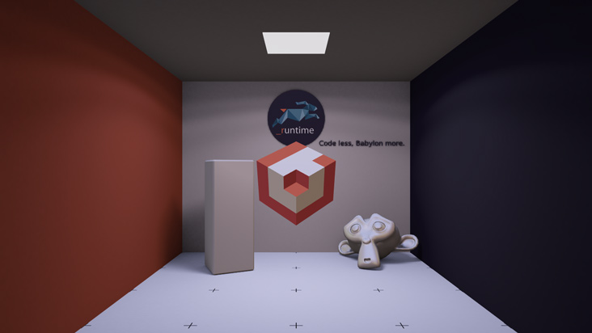

> yep, it works!

Now, how to patch our scene? Easiest way to do so is to call patch during launch. Try to guess what's each patch are doing:

```javascript
_r.launch({
    scene: "cornellBox.glb",
    // activating imported camera
    activeCamera: "Camera",
    patch: [{
            "*.wall01.*": {
                albedoColor: "green"
            }
        }, {
            "*.wall02.*": {
                albedoColor: "red"
            }
        }, {
            "suzanne.000": {
                metallic: 1,
                roughness: 0.15
            }
        },
        {
            "_r.000, bjs-logo.000": {
                unlit: true,
                disableLighting: true
            }
        },
        {
            "Camera": {
                speed: 0.1,
                minZ: 0.01
            }
        }
    ],
    beforeFirstRender: function () {
        // uncomment below to launch the Inspector
        // _r.scene.debugLayer.show();

        // we need an env map as we are in PBR
        _r.scene.createDefaultEnvironment({
            createGround: false,
            createSkybox: false
        });
    }
});
```

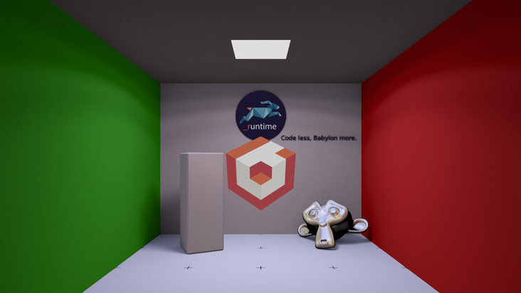

For comparaison, the raw javascript:

```javascript
BABYLON.SceneLoader.Append(
    "",
    "cornellBox.glb",
    scene,
    function (cornellBox) {
        // activating imported camera
        var camera = cornellBox.getCameraByName("Camera");
        camera.speed = 0.1;
        camera.minZ = 0.01;
        camera.attachControl(canvas, true);
        scene.activeCamera = camera;

        var wall01Mtl = cornellBox.getMaterialByName("cornellBox.wall01.000");
        wall01Mtl.albedoColor = BABYLON.Color3.Green();

        var wall02Mtl = cornellBox.getMaterialByName("cornellBox.wall02.000");
        wall02Mtl.albedoColor = BABYLON.Color3.Red();

        var suzanneMtl = cornellBox.getMaterialByName("suzanne.000");
        suzanneMtl.metallic = 1;
        suzanneMtl.roughness = 0.15;

        cornellBox.materials.forEach(function (mtl) {
            if ((mtl.name.indexOf("_r") != -1) ||
                (mtl.name.indexOf("logo") != -1)) {
                mtl.unlit = true;
                mtl.disableLighting = true;
            }
        });

        // uncomment below to launch the Inspector
        // scene.debugLayer.show();
    });
```

## Tool's potential

Below you'll find a bunch of screenshots from 3D applications running with the great help of \_runtime. They was made by the team of Axeon Software, composed by [Fabien Le Vavasseur](https://forum.babylonjs.com/u/sharp/) (core dev of \_runtime), [Sébastien Montlibert](https://forum.babylonjs.com/u/devaxeon/) (dev), [Quentin Davy](https://forum.babylonjs.com/u/crotmoul) (3D artist) and [myself](https://forum.babylonjs.com/u/Vinc3r/activity) (3D artist playing a bit with code), during the past years (since 2016 actually).

As you will see, all these scenes have a lot of assets, and our little artists team would have pulled each other's hair out if we had to tweak all of these in raw javascript. Even our devs use \_runtime to ease their scripts (similar as using jquery for web).

So, feel free to try \_runtime anytime, it can be easily integrated into an already existing project, without breaking everything, just check official website: https://babylon-runtime.github.io/

Demo | Description
:---: | :---
Hotel Atlantis<br> | [Available online](http://www.axeon.fr/CLIENT/UAE/Showreel/MAQUETTE_3D/3DRT/)<br>Allow a day/night circle.<br><br>70 drawcalls (16 mat, 592 meshes), 19 MB, 500k tri 
Château-Gaillard<br>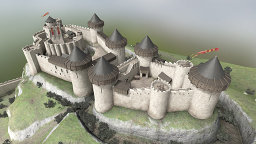 | (not yet available online)<br>Castle reconstruction as it was from 12th century.<br><br>159 drawcalls (153 mat, 631 meshes), 130 MB, 753k tri 
Virtual Staging<br>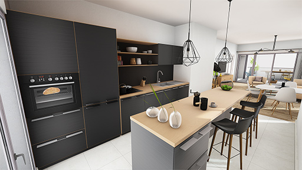 | [Available online](http://axeon.fr/CLIENT/INFIME/Virtual_Staging_V2/).<br>Appartment configurator.<br><br>450 drawcalls (444 mat, 542 meshes), 125 MB, 564k tri
La Bastille<br>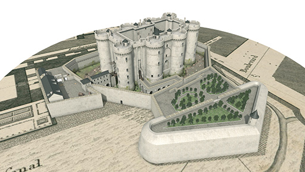 | [Available online](http://www.axeon.fr/CLIENT/AXEON_SOFTWARE/PARIS_Bastille/)<br>Bastille reconstruction before 1789.<br><br>406 drawcalls (252 mat, 540 meshes), 60 MB, 848k tri 
Petite duchesse<br> | (not yet available online)<br>Simplified 3D scan of a patisserie.<br><br>5 drawcalls (7 mat, 11 meshes), 12 MB, 87k tri 
Eiffage - Hypérion<br>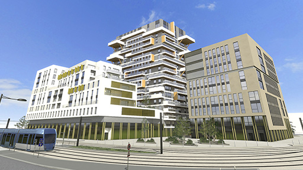 | [Available online](http://axeon.fr/CLIENT/EIFFAGE/Bordeaux.Hyperion/MAQUETTE_RT/).<br>Building project in Bordeaux (France).<br><br>833 drawcalls (378 mat, 1535 meshes), 127 MB, 457k tri 
Ilôt Vernon 1950<br>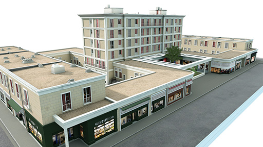 | [Available online](https://www.axeon.fr/CLIENT/AXEON_360/3DScan/Vernon_Pasteur/) (check LOD HD 400).<br>Based on a 2017 simplified 3D scan, reconstruction of the building in 1950.<br><br>133 drawcalls (127 mat, 174 meshes), 48 MB, 218k tri 
MacArthurGlen - Cannock<br>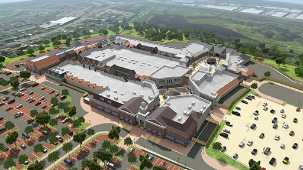 | Outlet village project.<br><br>204 drawcalls (151 mat, 1527 meshes), 75 MB, 2 600k tri 
Rosary<br> | Ancient Koranic rosary.<br><br>103 drawcalls (47 mat, 204 meshes), 20 MB, 283k tri 
Nexity - Asnières<br>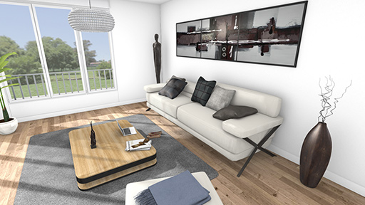 | [Available online](http://axeon.fr/CLIENT/NEXITY/Asnieres/).<br>Building project in Asnieres (France) (T3 appart in screenshot).<br><br>160 drawcalls (254 mat, 43 meshes), 133 MB , 372k tri

